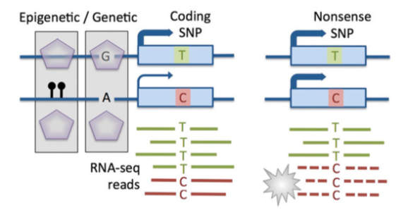
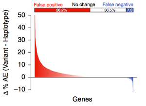
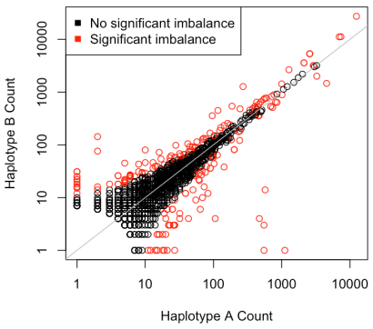
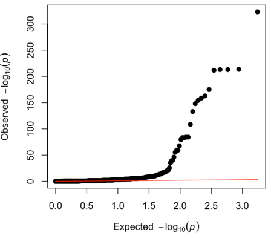

# IMPORTANT NOTE -- BUG FIX

A bug was introduced in version 0.9.8 (12/16/16) and fixed in version
0.9.9.4 (06/21/17) that caused problems with haplotypic counts when
using the `--haplo_count_blacklist` argument. This bug affects the
haplotypic counts generated (haplotypic_counts.txt), and any downstream
analyses of those counts, including generating gene level haplotypic
expression with `phASER_gene_ae`. If the` --haplo_count_blacklist`
was not specified, then the results were not affected. In addition, a
new `hg19_haplo_count_blacklist.bed.gz` file has been uploaded, which
addresses problems related to this issue. If you used the
`--haplo_count_blacklist` argument with a version of `phASER`
between 0.9.8 and 0.9.9.3 you must re-run your analyses with version
0.9.9.4+.

I often get asked
how to generate [a]llele [s]pecific [e]xpression
(ASE) data. ASE is a valuable data type that has a broad range of
applications in studies of gene regulation. Our lab has used it
to [identify imprinted
genes](http://genome.cshlp.org/content/early/2015/05/07/gr.192278.115.abstract), [study
protein truncating
variants](http://science.sciencemag.org/content/348/6235/666.long),
and [quantify the effect of cis-regulatory genetic
variation](http://biorxiv.org/content/early/2016/09/30/078717).
While the downstream analyses are varied and application specific, the
first step is always generating the ASE data itself.

  -----------------------------------------------------------------------------------------
  
  -----------------------------------------------------------------------------------------
  **Figure 1.** Schematic illustration of ASE data and three factors that can cause allelic
  imbalance: epigenetic (e.g. imprinting), genetic (e.g. cis-regulatory genetic variation),
  and protein truncating variants that cause nonsense mediated decay. (Castel *et al.*,
  *Genome Biology*, 2015)

  -----------------------------------------------------------------------------------------

At the most basic level ASE data consists of RNA-seq reads that overlap
a heterozygous variant, which depending on their sequence can be
assigned to one variant or the other. Generally heterozygous indels are
not used because of increased mapping bias. **In most cases the
heterozygous variant itself is not responsible for any observed allelic
imbalance -- it is simply a measure of the sum of regulatory activity
acting on the haplotype the variant finds itself on. **Exceptions to
this would be nonsense SNPs, splice variants, or variants which disrupt
regulatory motifs (e.g. miRNA binding sites in the 3′ UTR of a
gene). Many people get confused about this -- I've even seen
this mistake made in papers on ASE, so this is an important point to
keep in mind.

We previously published
a [paper](https://genomebiology.biomedcentral.com/articles/10.1186/s13059-015-0762-6) that
describes the characteristics of ASE data, best practices for data
generation and quality control, and points readers to some of the
many downstream statistical analyses. I highly suggest reading this as a
starting point for anyone interested in making use of ASE data.

  ----------------------------------------------------------------------------------
  
  ----------------------------------------------------------------------------------
  **Figure 2.** Reduction of false positive and negative allelic imbalance at genes
  using `phASER` haplotype level ASE versus single variants. (Castel *et
  al*., *Nature Communications*, 2016)

  ----------------------------------------------------------------------------------

Since then we developed a tool called
[`phASER`](http://www.nature.com/articles/ncomms12817) ([p]hasing and [ASE]
from [R]NA-seq), which produces high confidence
measurements of expression at the level of full haplotypes for each
gene. `phASER` improves on previous measures of ASE because
it measures ASE at the level of haplotypes as opposed to at single
heterozygous variants. `phASER` uses RNA-seq (and DNA-seq if
available) to phase heterozygous variants relative to one another, and
then aggregates counts across variants within a gene to produce a single
expression measurement for each haplotype. When a read overlaps multiple
variants, it is only counted once. In our paper we demonstrate that
using this approach with GEUVADIS data dramatically reduces the number
of false positives and improves sensitivity.

**We currently consider this to be the gold standard for generating ASE
data, and it can be used in whatever downstream analysis is most
appropriate for the scientific question of interest. In the rest of this
post I will describe step by step how to generate gene level haplotypic
counts for a single individual using `phASER`.**

# Generating ASE data with `phASER`

## 1. Download and setup `phASER`

You can download the latest version of `phASER` from
[Github](https://github.com/secastel/phaser):

`git clone https://github.com/secastel/phASER.git`

The requirements for running `phASER` as well as extensive
documentation can be found on the
[Github](https://github.com/secastel/phaser) page, so make
sure to check it out if you get stuck, or if you want to learn more
about advanced options.

Next you will need to compile `phASER`:

```
cd phaser/phaser/
python setup.py build_ext --inplace
cd ../../
```

_**Note:** To do a rendering "feature" of WordPress a double dash
is converted to an em dash. When running setup.py there should be two
dashes in front of "inplace"._

## 2. Download example data and required files

For this tutorial I will use a publicly available data set consisting of
LCL RNA-seq from GEUVADIS and genotype calls from 1000 Genomes Phase 3
for the individual NA06986.

<https://www.dropbox.com/s/u68p4po2fut2eid/NA06986.vcf.gz>  
<https://www.dropbox.com/s/328dvei4cqbs7n6/NA06986.vcf.gz.tbi>  
<https://www.dropbox.com/s/rxrr01dv4zyhagj/NA06986.2.M_111215_4.bam>  
<https://www.dropbox.com/s/vunmr97j8v6dqi8/NA06986.2.M_111215_4.bam.bai>  

```sh
wget --no-check-cert https://www.dropbox.com/s/u68p4po2fut2eid/NA06986.vcf.gz
wget --no-check-cert https://www.dropbox.com/s/328dvei4cqbs7n6/NA06986.vcf.gz.tbi
wget --no-check-cert https://www.dropbox.com/s/rxrr01dv4zyhagj/NA06986.2.M_111215_4.bam
wget --no-check-cert https://www.dropbox.com/s/vunmr97j8v6dqi8/NA06986.2.M_111215_4.bam.bai
```


-   **NA06986.vcf.gz** -- VCF containing genotype calls for the
    individual. Ideally these genotypes should have been previously
    phased using a method like population phasing. If you don't know how
    to do this, I would suggest using the [Sanger Imputation
    Service](https://imputation.sanger.ac.uk) which is easy
    to use and will population phase your sample using the massive
    [Haplotype Reference
    Consortium](http://www.nature.com/ng/journal/v48/n10/full/ng.3643.html)
    panel.

-   **NA06986.vcf.gz.tbi** -- tabix index for the VCF. `phASER`
    requires that input VCFs be tabix indexed. This can be generated for
    any position sorted, bgzipped VCF using the command 'tabix -p vcf
    sample.vcf.gz'.

-   **NA06986.2.M_111215_4.bam** -- BAM format file containing RNA-seq
    reads that have been aligned to the human genome using STAR.

-   **NA06986.2.M_111215_4.bam.bai** -- index for the BAM file
    that allows fast retrieval of reads based on genomic coordinates.
    This can be generated for any BAM using the command 'samtools index
    reads.bam'.

In addition to our sample data we will need a few files to run
`phASER`.

<https://www.dropbox.com/s/fbfntaa4oc75x6m/hg19_hla.bed.gz>  
<https://www.dropbox.com/s/rh1yp5c9bgguso1/hg19_haplo_count_blacklist.bed.gz>  
<https://www.dropbox.com/s/1u9zo1kx61zx6ca/gencode.v19.GRCh37.genes.bed.gz>  

```
wget --no-check-cert https://www.dropbox.com/s/fbfntaa4oc75x6m/hg19_hla.bed.gz
wget --no-check-cert https://www.dropbox.com/s/rh1yp5c9bgguso1/hg19_haplo_count_blacklist.bed.gz
wget --no-check-cert https://www.dropbox.com/s/1u9zo1kx61zx6ca/gencode.v19.GRCh37.genes.bed.gz
```

For these files:

-   **hg19_hla.bed.gz** -- this BED file contains all human HLA genes,
    which because of their high rate of genetic variation are difficult
    to map short reads to. These genes will be blacklisted from
    downstream analyses.

-   **hg19_haplo_count_blacklist.bed.gz** -- this BED file contains
    genomic positions that we have identified as either [showing bias
    in
    simulations](https://genomebiology.biomedcentral.com/articles/10.1186/s13059-014-0467-2) or
    having a UCSC mappability score \< 50. Variants that fall into these
    positions are used for phasing, but not for generating haplotypic
    counts to avoid problems with mapping bias.

-   **gencode.v19.GRCh37.genes.bed.gz** -- this BED file contains all
    human genes as defined by Genode for hg19. This file will be used to
    define genes when we are generating haplotype level counts.

You will need to decompress these files before they can be used by
`phASER`.

`gunzip *.bed.gz`

## 3. Run `phASER` with the example data**

Now we have everything we need to run `phASER`. In my testing with
this data set it took under 10 minutes using 8 threads on a quad core
2.8GHz Intel Core i7 with Hyper-threading.

```sh
python phaser/phaser/phaser.py \ 
    --vcf NA06986.vcf.gz \
    --bam NA06986.2.M_111215_4.bam \
    --paired_end 1 \
    --mapq 255 \
    --baseq 10 \
    --sample NA06986 \
    --blacklist hg19_hla.bed \
    --haplo_count_blacklist hg19_haplo_count_blacklist.bed \
    --threads 4 \
    --o phaser_test_case
```

Now I'll explain what each of the arguments are:

-   `--vcf NA06986.vcf.gz`: VCF ontaining genotype calls for
    the sample.

-   `bam NA06986.2.M_111215_4.bam`: BAM containing RNA-seq reads.

-   `--paired_end 1`: Specifying that the reads come from a paired end
    experiment.

-   `--mapq 255`: Minimum mapping quality of reads to use for phasing
    and ASE. This should be set to a value that will ensure reads are
    uniquely mapped. When STAR is used this number is 255, however it
    will differ based on the aligner.

-   `--baseq 10`: Minimum base quality at the heterozygous SNP for a
    read to be used.

-   `--sample NA06986`: Name of the sample in the VCF file.

-   `--blacklist hg19_hla.bed`: List of sites to blacklist from
    phasing. The file we are providing contains all HLA genes.

-   `--haplo_count_blacklist hg19_haplo_count_blacklist.bed`: List of
    sites to blacklist when generating allelic counts. These are sites
    that we have previously identified as having mapping bias, so
    excluding them will improve results.

-   `--threads 4`: Number of threads to use.

-   `--o phASER_test_case`: Output file prefix.

If `phASER` ran successfully you should see a message like this:

```
COMPLETED using 1591165 reads in 595 seconds using 8 threads
```

## 4. Generate haplotype expression quantifications

Now that `phASER` has been run  takes the output files from `phASER`we can use a companion tool called
`phASER_gene_ae.py`, which
along with gene annotations and produces gene level haplotype expression
quantifications.


```sh
python phaser/phaser_gene_ae/phaser_gene_ae.py \
    --haplotypic_counts phaser_test_case.haplotypic_counts.txt \
    --features gencode.v19.GRCh37.genes.bed \
    --o phaser_test_case_gene_ae.txt
```

With the arguments being:

-   `--haplotypic_counts phASER_test_case.haplotypic_counts.txt`: This
    is one of the output files from `phASER`. It contains read counts
    for all haplotype blocks as well as individual SNPs and their
    phasing relative to one another.

-   `--gencode.v19.GRCh37.genes.bed`: Contains the coordinates for all
    the genes we would like to calculate haplotypic expression for. It
    is very important that the chromosome naming be consistent between
    this file, the VCF and the BAM.

-   `--o phASER_test_case_gene_ae.txt`: Name of output file.

-   `--no_gw_phase 0`: This option can be turned on (by setting to 1)
    if the input VCF that was used was not previously phased. If you
    can, I highly suggest phasing the input VCF using e.g. population
    phasing as previously mentioned, however in some cases this may not
    be possible. For example,  if you are working with a model organism
    and lack trio data.This should run relatively quickly, it took only
    a few minutes on my laptop.

That's it! You've now measured haplotype level expression at each gene
for your RNA-seq sample. Of course, what you decide to do next is the
hard part, and this is very specialized depending on the specific
scientific question that you are asking. Nonetheless you have excellent
quality haplotypic counts that will be a huge improvement for any
downstream analyses over using single ASE variants alone.

**Exploring the haplotype expression data**

Below is a description of each column in the output file to get you
started:

-   **contig** -- Gene chromosome.

-   **start** -- Gene start (0 based).

-   **stop** -- Gene stop (0 based).

-   **name** -- Gene name.

-   **aCount** -- Total allelic count for haplotype A.

-   **bCount** -- Total allelic count for haplotype B.

-   **totalCount** -- Total allelic coverage of this feature (aCount +
    bCount).

-   **log2_aFC** -- Effect size for the allelic imbalance reported as
    allelic fold change (log2(aCount/bCount)) defined in our
    [paper](http://biorxiv.org/content/early/2016/09/30/078717).

-   **n_variants** -- Number of variants with allelic data in this
    feature.

-   **variants** -- List of variants with allelic data in this feature
    (contig_position_ref_alt).

The **aCount** and **bCount** columns list the number of reads that
could be uniquely mapped to each haplotype and can be used for any
downstream analysis of ASE data. We also include allelic fold change
(aFC), a measurement we put forward in a recent
[paper](http://biorxiv.org/content/early/2016/09/30/078717)
that is an easy to interpret quantification of the expression of one
haplotype versus the other. A value of 1.0 for example indicates that
haplotype A is expressed 2 times more than haplotype B.

In cases where an unphased input VCF was used the haplotype designations
of A and B are random. However, if a phased VCF is used, as in this
example, then haplotype A corresponds to the first haplotype in the VCF
and haplotype B corresponds to the second haplotype. For example, from
the NA06986 VCF:

```
1   774760  rs187867912 C   T   100 PASS    .   GT  0|1
```

This individual is heterozygous for a variant where the reference allele
is found on haplotype A and the alternative allele is found on haplotype
B. If the GT field were '1|0' it would be the other way around.

If you are looking to quantify the effect of cis-regulatory genetic
variation in your samples you may want to for example, calculate the
median aFC in a population for all individuals that are heterozygous for
the top eQTL in a given gene as we did in the [v6 GTEx cis-eQTL
paper](http://biorxiv.org/content/early/2016/09/09/074450).

**Next, try making a few plots to get a sense for the data**, and check
out some of the top genes by allelic imbalance. The classic way that we
look at ASE data for QC purposes it to plot haplotype A count versus
haplotype B count in log-log space. Below is some R code to get you
started.

.R

```r
# load haplotypic counts
phaser_test_case_gene_ae = read.delim("phaser_test_case_gene_ae.txt")
# select only genes with sufficient coverage
cov8 = subset(phaser_test_case_gene_ae, phaser_test_case_gene_ae$totalCount >= 8)
# perform a binomial test for deviation from 0.5
cov8$binom_p = apply(cov8[,c("aCount","bCount")], 1, function(x) binom.test(x[1],x[1]+x[2],p=0.5)$p.value)
# perform multiple testing correction with FDR
cov8$binom_q = p.adjust(cov8$binom_p, method = "fdr")
# plot haplotype A versus haplotype, highlight sites with significant imbalance (FDR < 5%)
plot(cov8$bCount, cov8$aCount, log="xy", col=(cov8$binom_q<0.05)+1, ylab="Haplotype B Count", xlab="Haplotype A Count")
abline(0,1,col="grey")
legend("topleft",c("No significant imbalance","Significant imbalance"),pch=c(15,15),col=c(1,2))
```

  -----------------------------------------------------------------------
  
  -----------------------------------------------------------------------
  **Figure 3.** Haplotype counts in log-log space with significance of
  imbalance determined using a binomial test.

  -----------------------------------------------------------------------

This plot shows the expression of one haplotype versus another, it's
great to get an overview of your data and identify any systemic
problems. It uses a binomial test to determine if genes have significant
allelic imbalance (deviation from 50/50 expression). This is a commonly
used test, however it suffers from many problems that we and others have
discussed. See the 'Statistical tests for AE' section of our [Genome
Biology
paper](https://genomebiology.biomedcentral.com/articles/10.1186/s13059-015-0762-6)
for a detailed discussion. The most prominent issue is that ASE data are
overdispersed compared to what is expected under a binomial distribution
as a result of a combination of technical and biological factors. This
results in extremely inflated p-values that can be visualized using a
simple QQ plot.

.R

```
# QQ plot of pvalues (code from: http://www.gettinggeneticsdone.com/2010/07/qq-plots-of-p-values-in-r-using-base.html)
ggd.qqplot = function(pvector, main=NULL, ...) {
o = -log10(sort(pvector,decreasing=F))
e = -log10( 1:length(o)/length(o) )
plot(e,o,pch=19,cex=1, main=main, ...,
xlab=expression(Expected~~-log[10](italic(p))),
ylab=expression(Observed~~-log[10](italic(p))),
xlim=c(0,max(e)), ylim=c(0,max(o)))
lines(e,e,col="red")
}
ggd.qqplot(cov8[cov8$binom_p>0,]$binom_p)

```

  -----------------------------------------------------------------------
  
  -----------------------------------------------------------------------
  **Figure 4.** QQ plot of expected versus observed p-values arising from
  a binomial test of haplotypic counts.

  -----------------------------------------------------------------------

Wow! Look at how inflated those p-values are! Keep this in mind when
performing any downstream analyses. Careful QC of ASE data is required
to ensure that you will best be able to answer your biological question
of interest. For example, in our test data ENSG00000232629 (HLA-DQB2)
has strong allelic imbalance, however this likely driven by mapping
bias. Be wary of pseudogenes, multi-copy genes, and genes with large
amounts of genetic variation as these often suffer from extreme mapping
bias issues. Careful curation of your gene set is of the utmost
important for any downstream analyses.

With that in mind go forward and generate ASE data! It's an exciting
data type with lots of potential, but as with all data types you need to
be aware of its strengths and limitations to get the most out of it.
